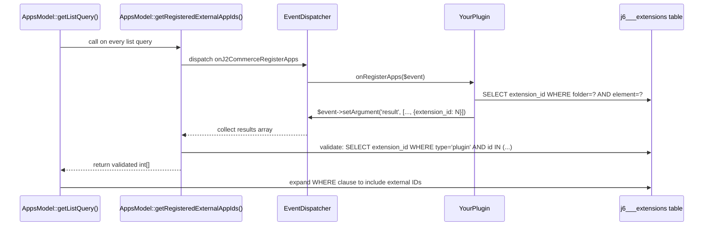

# Registering External Plugins in the Apps View

The J2Commerce Apps view (`index.php?option=com_j2commerce&view=apps`) natively lists plugins from the `j2commerce` plugin group whose element name starts with `app_`. The `onJ2CommerceRegisterApps` event hook extends this to include plugins from **any** Joomla plugin group — `system`, `content`, `task`, or any other group. Once registered, external plugins appear alongside native app plugins with full support for enable/disable, filtering, sorting, and pagination.

## When to Use This Hook

Use this hook when:

- Your plugin lives in the `system` or another group for technical reasons but is functionally a J2Commerce integration.
- You are building a third-party add-on that store administrators should discover and manage from the J2Commerce Apps view rather than hunting through the global Plugin Manager.
- Your plugin already appears in the `j2commerce` group under a non-`app_` element name (e.g., `report_*`, `payment_*`) — those are included natively and do **not** need this hook.

## Architecture



## Event Specification

| Property | Value |
|---|---|
| Event name | `onJ2CommerceRegisterApps` |
| Dispatched by | `AppsModel::getRegisteredExternalAppIds()` |
| Response mechanism | Append to `$event->getArgument('result', [])` then `$event->setArgument('result', $result)` |
| Caching | Per-request (`$externalAppIds` property, reset between requests) |
| Validation | IDs cast to `int`, must be `> 0`, verified against `#__extensions` with `type = 'plugin'` |
| Safe default | If zero plugins respond or an exception is thrown, the query reverts to the unmodified native-only WHERE clause |

The event is dispatched using Joomla's standard `GenericEvent`. **Do not use `$event->addResult()`** — that method does not exist on `GenericEvent`. Instead, read the current `result` argument, append your entry, and write it back with `setArgument()`. The response array key must be exactly `extension_id`. Any other keys in the array are ignored.

## Complete Working Example

The following files implement a minimal `system` plugin that registers itself in the Apps view. Adapt the namespace, element name, and file paths to your own plugin.

### Plugin Class

```php
<?php
// File: plugins/system/mymyintegration/src/Extension/MymyIntegration.php

declare(strict_types=1);

namespace Acme\Plugin\System\MymyIntegration\Extension;

\defined('_JEXEC') or die;

use Joomla\CMS\Plugin\CMSPlugin;
use Joomla\Database\DatabaseAwareTrait;
use Joomla\Event\Event;
use Joomla\Event\SubscriberInterface;

final class MymyIntegration extends CMSPlugin implements SubscriberInterface
{
    use DatabaseAwareTrait;

    public $autoloadLanguage = true;

    public static function getSubscribedEvents(): array
    {
        return [
            'onJ2CommerceRegisterApps' => 'onRegisterApps',
        ];
    }

    public function onRegisterApps(Event $event): void
    {
        $db    = $this->getDatabase();
        $query = $db->getQuery(true)
            ->select($db->quoteName('extension_id'))
            ->from($db->quoteName('#__extensions'))
            ->where($db->quoteName('type') . ' = ' . $db->quote('plugin'))
            ->where($db->quoteName('folder') . ' = ' . $db->quote('system'))
            ->where($db->quoteName('element') . ' = ' . $db->quote('mymyintegration'));

        $extensionId = (int) $db->setQuery($query)->loadResult();

        if ($extensionId > 0) {
            $result = $event->getArgument('result', []);
            $result[] = ['extension_id' => $extensionId];
            $event->setArgument('result', $result);
        }
    }
}
```

The handler queries the database for its own `extension_id` rather than hard-coding a value. This is safe for multi-site installations and survives reinstall without ID changes.

### Service Provider

```php
<?php
// File: plugins/system/mymyintegration/services/provider.php

\defined('_JEXEC') or die;

use Acme\Plugin\System\MymyIntegration\Extension\MymyIntegration;
use Joomla\CMS\Extension\PluginInterface;
use Joomla\CMS\Factory;
use Joomla\CMS\Plugin\PluginHelper;
use Joomla\DI\Container;
use Joomla\Database\DatabaseInterface;
use Joomla\DI\ServiceProviderInterface;
use Joomla\Event\DispatcherInterface;

return new class implements ServiceProviderInterface
{
    public function register(Container $container): void
    {
        $container->set(
            PluginInterface::class,
            function (Container $container) {
                $plugin = new MymyIntegration(
                    $container->get(DispatcherInterface::class),
                    (array) PluginHelper::getPlugin('system', 'mymyintegration')
                );
                $plugin->setApplication(Factory::getApplication());
                $plugin->setDatabase($container->get(DatabaseInterface::class));
                return $plugin;
            }
        );
    }
};
```

### XML Manifest

```xml
<?xml version="1.0" encoding="utf-8"?>
<extension type="plugin" group="system" method="upgrade">
    <name>PLG_SYSTEM_MYMYINTEGRATION</name>
    <author>Acme Corp</author>
    <version>1.0.0</version>
    <description>PLG_SYSTEM_MYMYINTEGRATION_XML_DESCRIPTION</description>
    <namespace path="src">Acme\Plugin\System\MymyIntegration</namespace>
    <files>
        <folder plugin="mymyintegration">services</folder>
        <folder>src</folder>
        <folder>language</folder>
        <folder>media</folder>
    </files>
    <languages folder="language">
        <language tag="en-GB">en-GB/plg_system_mymyintegration.ini</language>
        <language tag="en-GB">en-GB/plg_system_mymyintegration.sys.ini</language>
    </languages>
    <media destination="plg_system_mymyintegration" folder="media">
        <folder>images</folder>
    </media>
</extension>
```

### Language File

```ini
; File: plugins/system/mymyintegration/language/en-GB/plg_system_mymyintegration.ini

PLG_SYSTEM_MYMYINTEGRATION="My Integration"
PLG_SYSTEM_MYMYINTEGRATION_XML_DESCRIPTION="Integrates My Service with J2Commerce."
```

The `<name>` language key is what appears in the **Name** column of the Apps view. The `<description>` language key is shown as the truncated description text below the plugin name.

### Plugin Image

Place a 300×200 px `.webp` image at:

```
media/plg_system_mymyintegration/images/mymyintegration.webp
```

The image filename must match the plugin element name. The Apps view template resolves images using this pattern:

```
media/plg_{folder}_{element}/images/{element}.{jpg|png|webp}
```

It checks `.jpg`, `.png`, and `.webp` in that order. If no image is found, a placeholder is displayed. The `media/` folder under the plugin source is copied to the Joomla root `media/` directory during installation, provided the manifest declares a `<media>` section as shown above.

## How the Apps View Handles External Plugins

### SQL WHERE Clause Expansion

`AppsModel::getListQuery()` calls `getRegisteredExternalAppIds()` before building its query. When one or more external IDs are returned, the native clause:

```sql
WHERE a.folder = 'j2commerce' AND a.element LIKE 'app_%'
```

is replaced by:

```sql
WHERE (
    (a.folder = 'j2commerce' AND a.element LIKE 'app_%')
    OR a.extension_id IN (:extId0, :extId1, ...)
)
```

All filtering (enabled state, plugin type, search), sorting, and pagination continue to work at the database level without modification.

### Image Resolution

The template resolves the image path using `$item->folder` and `$item->element`, which are pulled directly from `#__extensions`. The lookup sequence is:

1. `media/plg_{folder}_{element}/images/{element}.jpg`
2. `media/plg_{folder}_{element}/images/{element}.png`
3. `media/plg_{folder}_{element}/images/{element}.webp`
4. `plugins/{folder}/{element}/images/{element}.png` (legacy fallback)
5. `media/com_j2commerce/images/{element}.png` (legacy fallback)
6. `media/com_j2commerce/images/default_app_j2commerce.webp` (final fallback)

### Language Loading

`HtmlView::loadAppPluginLanguages()` loads language files for both native and external plugins before the list renders. For an external plugin with folder `system` and element `mymyintegration` it loads:

```php
$lang->load('plg_system_mymyintegration', JPATH_ADMINISTRATOR)
    || $lang->load('plg_system_mymyintegration', JPATH_PLUGINS . '/system/mymyintegration');
```

This means `Text::_($item->name)` and `Text::_($item->description)` resolve correctly in the list even though the plugin is not in the `j2commerce` group.

### Edit Link Routing

All plugins — both native `j2commerce` group and external — open in the standard Joomla Plugin Manager (`index.php?option=com_plugins&task=plugin.edit&extension_id=N`) when the user clicks their name or image. There is no separate J2Commerce app editor view.

### Source Badge

When `$item->folder` is not `j2commerce`, the template renders a small Bootstrap `badge bg-info` next to the plugin name showing the folder:

```
My Integration  [system]
```

This distinguishes external plugins from native J2Commerce app plugins at a glance.

## Requirements Checklist

Before the hook works correctly, verify all of the following:

- [ ] Plugin is installed and enabled in Joomla (visible in **System** -> **Manage** -> **Plugins**)
- [ ] Plugin class uses `DatabaseAwareTrait` and service provider calls `$plugin->setDatabase()`
- [ ] `getSubscribedEvents()` maps `onJ2CommerceRegisterApps` to a valid method name
- [ ] The handler appends to `$event->getArgument('result', [])` and calls `$event->setArgument('result', $result)` with a positive integer `extension_id`
- [ ] The `extension_id` exists in `#__extensions` with `type = 'plugin'`
- [ ] Language file is named `plg_{folder}_{element}.ini` and contains the `PLG_*` name and description language keys
- [ ] Plugin image is placed at `media/plg_{folder}_{element}/images/{element}.webp` (or `.jpg` / `.png`)
- [ ] Manifest `<media>` section declares the images folder so Joomla copies it to the root `media/` directory on install

## Troubleshooting

### Plugin does not appear in the Apps view

1. **Missing `DatabaseAwareTrait`:** Your plugin class must `use DatabaseAwareTrait;` and your service provider must call `$plugin->setDatabase($container->get(DatabaseInterface::class))`. Without both, `$this->getDatabase()` throws `Call to undefined method`, which `AppsModel` catches silently — the plugin just doesn't appear with no visible error.
2. **Using `$event->addResult()`:** `GenericEvent` does not have an `addResult()` method. This throws `Call to undefined method`, again caught silently. Use `getArgument()`/`setArgument()` as shown in the example above.
3. Confirm the plugin is **enabled** in the Plugin Manager. Disabled plugins still receive events, but `AppsModel` verifies the returned ID against `#__extensions` — a disabled plugin still has a valid record and will be included. If it is not appearing at all, the ID returned by your handler is likely `0` (plugin not found in the database).
4. Check the element name and folder passed to your database query match exactly what is in `#__extensions`. Use `DESCRIBE j6__extensions` or query `SELECT folder, element, extension_id FROM j6__extensions WHERE type = 'plugin' AND element LIKE '%myintegration%'` to confirm.
5. The `onJ2CommerceRegisterApps` event is only dispatched when the Apps view is loaded. It is not fired on other pages.

### Plugin name shows as a language key (not translated)

The Apps view loads language files before rendering the list, but only for plugins whose `extension_id` was returned by `getRegisteredExternalAppIds()`. If your language file is not loading:

1. Verify the file is named exactly `plg_{folder}_{element}.ini` — the naming is case-sensitive on Linux hosts.
2. Confirm the language file is present in `administrator/language/en-GB/` at the Joomla root (not only inside the plugin directory). Installation via the manifest `<languages>` tag copies it there; manually installed plugins may need this done manually.
3. If testing before installation, place the file directly at `JPATH_ADMINISTRATOR/language/en-GB/plg_system_mymyintegration.ini`.

### Plugin image shows the placeholder instead of my image

1. Confirm the image is at `media/plg_{folder}_{element}/images/{element}.webp` under the **Joomla root** `media/` directory — not under `plugins/`. The manifest `<media>` section copies it there during installation.
2. Check the filename matches the element name exactly: for folder `system` and element `mymyintegration`, the file must be `mymyintegration.webp`.
3. If you installed manually (not via the installer), copy the file from `plugins/system/mymyintegration/media/images/mymyintegration.webp` to `media/plg_system_mymyintegration/images/mymyintegration.webp`.

### Edit link opens the wrong page

External plugins (any folder other than `j2commerce`) always route to the standard Joomla Plugin Manager editor (`com_plugins&task=plugin.edit`). This is intentional. If you want a custom configuration interface, build it as a separate admin view in your own component and link to it from within the Plugin Manager edit form.

## Source File Reference

| File | Description |
|---|---|
| `administrator/components/com_j2commerce/src/Model/AppsModel.php` | `getRegisteredExternalAppIds()` dispatches the event; `getListQuery()` expands the WHERE clause |
| `administrator/components/com_j2commerce/src/View/Apps/HtmlView.php` | `loadAppPluginLanguages()` loads language files for both native and external plugins |
| `administrator/components/com_j2commerce/tmpl/apps/default.php` | Renders the plugin list; resolves images, edit links, and source badge using `$item->folder` |

## Related

- [Dashboard Plugin Events](../../features/dashboard-events.md)
- [Dashboard Extensions](../../features/dashboard-extensions.md)
