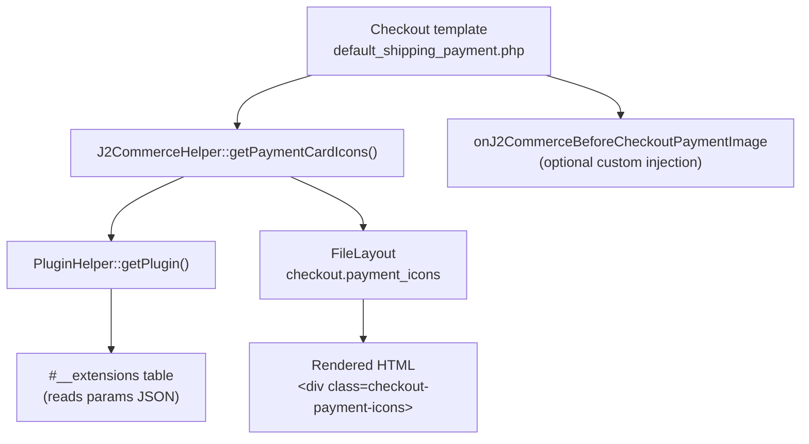

# Payment Card Icons

J2Commerce renders accepted card type icons (Visa, Mastercard, etc.) alongside each payment method in the checkout payment list. Icons are matched automatically from a plugin's `card_types` parameter against the SVG files bundled in `media/com_j2commerce/images/payment-methods/`.

## Architecture



## Key Classes and Files

| File | Purpose |
|------|---------|
| `administrator/components/com_j2commerce/src/Helper/J2CommerceHelper.php` | `getPaymentCardIcons()` static method |
| `administrator/components/com_j2commerce/src/Helper/PluginHelper.php` | `getPlugin()` — reads plugin row from `#__extensions` |
| `components/com_j2commerce/layouts/checkout/payment_icons.php` | Layout that renders the icon `<div>` block |
| `components/com_j2commerce/tmpl/checkout/default_shipping_payment.php` | Checkout template that calls both the event and the helper |
| `media/com_j2commerce/images/payment-methods/` | Bundled SVG icon files |

## Bundled SVG Icons

The following SVG files ship with J2Commerce in `media/com_j2commerce/images/payment-methods/`:

| Filename | Card type value |
|----------|----------------|
| `amex.svg` | `amex` |
| `applepay.svg` | `applepay` |
| `discover.svg` | `discover` |
| `googlepay.svg` | `googlepay` |
| `maestro.svg` | `maestro` |
| `mastercard.svg` | `mastercard` |
| `paypal.svg` | `paypal` |
| `visa.svg` | `visa` |

The `card_types` option values in a plugin's XML **must exactly match** the filename stem (without `.svg`) for the icon to render.

## How `getPaymentCardIcons()` Works

```php
// File: administrator/components/com_j2commerce/src/Helper/J2CommerceHelper.php

public static function getPaymentCardIcons(string $element): string
{
    if (empty($element)) {
        return '';
    }

    $plugin = static::plugin()->getPlugin($element, 'j2commerce');
    if (!$plugin) {
        return '';
    }

    $params    = new Registry($plugin->params ?? '{}');
    $cardTypes = $params->get('card_types', []);

    if (empty($cardTypes)) {
        return '';
    }

    if (\is_string($cardTypes)) {
        $cardTypes = explode(',', $cardTypes);
    }

    $cardTypes = array_map('trim', (array) $cardTypes);
    $cardTypes = array_filter($cardTypes);

    if (empty($cardTypes)) {
        return '';
    }

    $iconsDir = JPATH_SITE . '/media/com_j2commerce/images/payment-methods';
    $matched  = [];

    foreach ($cardTypes as $type) {
        $svgPath = $iconsDir . '/' . $type . '.svg';
        if (file_exists($svgPath)) {
            $matched[] = [
                'type' => $type,
                'url'  => Uri::root(true) . '/media/com_j2commerce/images/payment-methods/' . $type . '.svg',
            ];
        }
    }

    if (empty($matched)) {
        return '';
    }

    $layout = new FileLayout('checkout.payment_icons', JPATH_SITE . '/components/com_j2commerce/layouts');

    return $layout->render([
        'element'    => $element,
        'card_types' => $matched,
    ]);
}
```

### Processing notes

- `card_types` stored in the plugin's `params` JSON can be either a comma-separated string (older serialisation) or a JSON array (from a `multiple="true"` list field). Both are normalised.
- Only card types with a matching SVG on disk are included. Unknown values are silently skipped.
- Returns an empty string — not an exception — when the plugin is not found, the param is empty, or no SVGs match.

## The `payment_icons` Layout

```php
// File: components/com_j2commerce/layouts/checkout/payment_icons.php

$element   = $displayData['element'] ?? '';
$cardTypes = $displayData['card_types'] ?? [];
```

`$displayData` keys:

| Key | Type | Description |
|-----|------|-------------|
| `element` | `string` | Plugin element name, used as the wrapper div ID prefix |
| `card_types` | `array` | Array of matched icons; each entry has `type` (string) and `url` (string) |

Rendered HTML structure:

```html
<div id="payment_authorizenet_payment_icons"
     class="checkout-payment-icons d-flex align-items-center justify-content-end gap-1 gap-sm-2">
    <div class="payment-icon payment-icon-visa">
        
    </div>
    <div class="payment-icon payment-icon-mastercard">
        
    </div>
</div>
```

The `alt` text is built from the card type slug and the `COM_J2COMMERCE_PAYMENT_OPTION` language string for accessibility.

## Checkout Template Integration

```php
// File: components/com_j2commerce/tmpl/checkout/default_shipping_payment.php

<?php echo J2CommerceHelper::plugin()->eventWithHtml('BeforeCheckoutPaymentImage', [$method, 'onJ2Commerce'])->getArgument('html', ''); ?>
<?php echo J2CommerceHelper::getPaymentCardIcons($element); ?>
```

The `onJ2CommerceBeforeCheckoutPaymentImage` event fires first (for custom HTML injection by the payment plugin itself), then `getPaymentCardIcons()` appends the standard card icons. Either or both may produce output for the same payment method row.

## Adding `card_types` to a Payment Plugin

Declare a `multiple="true"` list field named `card_types` in the plugin's XML config block. The `value` attributes must match the SVG filename stems.

```xml
<!-- File: plugins/j2commerce/payment_yourplugin/payment_yourplugin.xml -->

<field
    name="card_types"
    type="list"
    label="PLG_J2COMMERCE_PAYMENT_YOURPLUGIN_CARD_TYPES"
    description="PLG_J2COMMERCE_PAYMENT_YOURPLUGIN_CARD_TYPES_DESC"
    default="visa,mastercard"
    layout="joomla.form.field.list-fancy-select"
    multiple="true"
>
    <option value="visa">PLG_J2COMMERCE_PAYMENT_YOURPLUGIN_VISA</option>
    <option value="mastercard">PLG_J2COMMERCE_PAYMENT_YOURPLUGIN_MASTERCARD</option>
    <option value="discover">PLG_J2COMMERCE_PAYMENT_YOURPLUGIN_DISCOVER</option>
    <option value="amex">PLG_J2COMMERCE_PAYMENT_YOURPLUGIN_AMEX</option>
    <option value="applepay">PLG_J2COMMERCE_PAYMENT_YOURPLUGIN_APPLEPAY</option>
    <option value="googlepay">PLG_J2COMMERCE_PAYMENT_YOURPLUGIN_GOOGLEPAY</option>
    <option value="paypal">PLG_J2COMMERCE_PAYMENT_YOURPLUGIN_PAYPAL</option>
    <option value="maestro">PLG_J2COMMERCE_PAYMENT_YOURPLUGIN_MAESTRO</option>
</field>
```

Configure defaults to the card types your gateway actually supports. Joomla serialises a multi-select list as a JSON array in `#__extensions.params`.

## Custom Icon Injection via Event

Payment plugins that need to inject their own HTML before or instead of the standard icons subscribe to `onJ2CommerceBeforeCheckoutPaymentImage`.

```php
// File: plugins/j2commerce/payment_yourplugin/src/Extension/PaymentYourplugin.php

declare(strict_types=1);

namespace J2Commerce\Plugin\J2Commerce\PaymentYourplugin\Extension;

use Joomla\CMS\Plugin\CMSPlugin;
use Joomla\Event\Event;
use Joomla\Event\SubscriberInterface;

class PaymentYourplugin extends CMSPlugin implements SubscriberInterface
{
    public static function getSubscribedEvents(): array
    {
        return [
            'onJ2CommerceBeforeCheckoutPaymentImage' => 'onBeforeCheckoutPaymentImage',
        ];
    }

    public function onBeforeCheckoutPaymentImage(Event $event): void
    {
        $args   = $event->getArguments();
        $method = $args[0] ?? [];

        if (($method['element'] ?? '') !== $this->_name) {
            return;
        }

        $result   = $event->getArgument('result', []);
        $result[] = '<div class="my-custom-badge">Secured by YourPluign</div>';
        $event->setArgument('result', $result);
    }
}
```

### Event details

| Property | Value |
|----------|-------|
| Event name | `onJ2CommerceBeforeCheckoutPaymentImage` |
| Fired from | `components/com_j2commerce/tmpl/checkout/default_shipping_payment.php` |
| First argument | `$method` — the payment method array from the checkout view |
| Return mechanism | `$event->setArgument('result', $result)` — append HTML strings to the result array |

The `eventWithHtml()` dispatcher collects all result strings, concatenates them, and stores the final HTML in `$event->getArgument('html')`. Never return a value directly from the handler; it is silently discarded.

## Template Overrides

The `payment_icons` layout can be overridden per Joomla's standard layout override path:

```
templates/{your-template}/html/layouts/com_j2commerce/checkout/payment_icons.php
```

The override receives the same `$displayData` array as the core layout:

```php
$element   = $displayData['element'];   // string — plugin element name
$cardTypes = $displayData['card_types']; // array  — [['type' => 'visa', 'url' => '...'], ...]
```

## Related

- [Payment Plugin Development](../payment-plugin-development.md)
- [Checkout Events Reference](../../../../api-reference/events.md)
