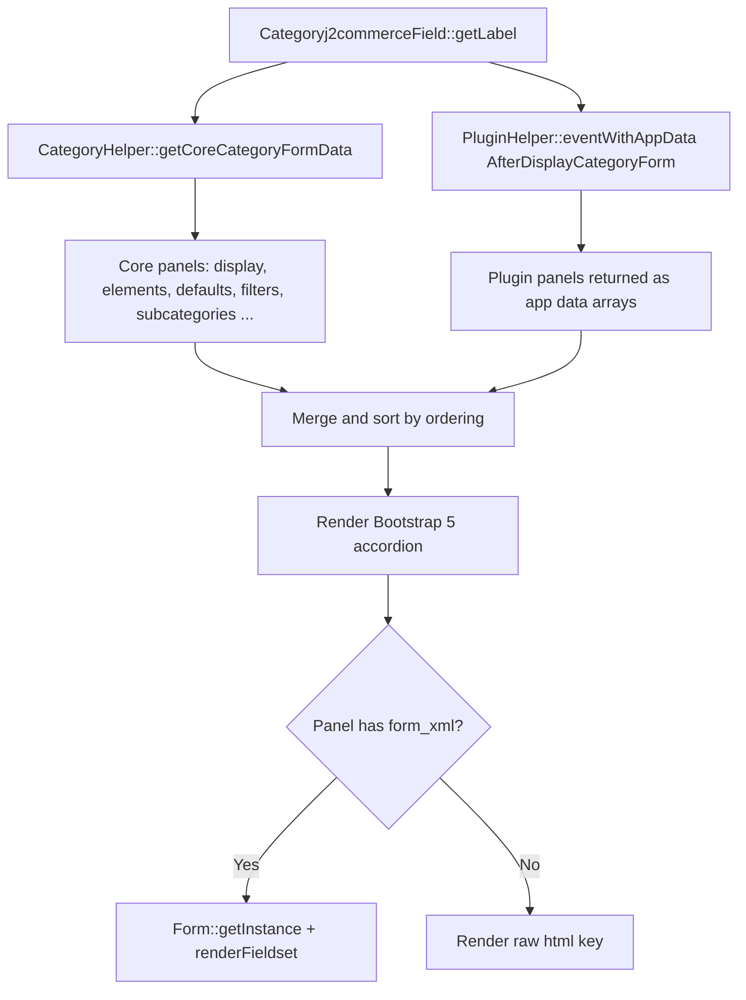

# Categoryj2commerce Form Field

`Categoryj2commerceField` is a `SpacerField` subclass that renders a Bootstrap 5 accordion on the Joomla category edit form. Each accordion panel contains a section of J2Commerce category configuration — such as display settings, product element visibility, default values, and filters. Core panels are generated by `CategoryHelper::getCoreCategoryFormData()`. App plugins contribute additional panels via the `onJ2CommerceAfterDisplayCategoryForm` event.

This field produces no form input. It exists purely to inject a rich UI component into an existing Joomla core form.

## Key Classes

| Class | File | Purpose |
|-------|------|---------|
| `Categoryj2commerceField` | `administrator/components/com_j2commerce/src/Field/Categoryj2commerceField.php` | Renders the accordion container |
| `CategoryHelper` | `administrator/components/com_j2commerce/src/Helper/CategoryHelper.php` | `getCoreCategoryFormData()` — returns core accordion panel definitions |
| `PluginHelper` (J2Commerce) | `administrator/components/com_j2commerce/src/Helper/PluginHelper.php` | `eventWithAppData()` — collects plugin-contributed panels |

## Architecture



## Core Accordion Panels

`CategoryHelper::getCoreCategoryFormData()` returns the following panels, ordered by the `ordering` key:

| Element key | Language name | Form XML | Ordering |
|-------------|--------------|----------|---------|
| `category_display` | `COM_J2COMMERCE_CATEGORY_DISPLAY_SETTINGS` | `forms/category_display.xml` | 10 |
| `category_elements` | `COM_J2COMMERCE_CATEGORY_PRODUCT_ELEMENTS` | `forms/category_elements.xml` | 20 |
| `category_defaults` | `COM_J2COMMERCE_CATEGORY_PRODUCT_DEFAULTS` | `forms/category_defaults.xml` | 30 |
| `category_filters` | `COM_J2COMMERCE_CATEGORY_FILTER_CONFIG` | `forms/category_filters.xml` | 40 |
| `category_subcategories` | `COM_J2COMMERCE_CATEGORY_SUBCATEGORY_SETTINGS` | `forms/category_subcategories.xml` | 50 |

Each panel's form fields are bound with the existing category's `params.j2commerce.*` values before rendering.

## Form Field Naming Convention

All fields rendered inside the accordion use `jform[params][j2commerce]` as the control prefix. For example, a field named `products_per_page` in a category form panel submits as:

```
jform[params][j2commerce][products_per_page]
```

The Joomla category model stores this under `params` in `#__categories`.

## Plugin Event: `onJ2CommerceAfterDisplayCategoryForm`

App plugins can inject additional accordion panels by handling this event:

| Detail | Value |
|--------|-------|
| Event name | `onJ2CommerceAfterDisplayCategoryForm` |
| Event method | `PluginHelper::eventWithAppData('AfterDisplayCategoryForm', ...)` |
| Plugin group | `j2commerce` |
| Return format | Array with `element` key (required) + optional `name`, `description`, `image`, `form_xml`, `html`, `data`, `ordering` |

### Adding a Custom Category Settings Panel

```php
// File: plugins/j2commerce/app_yourplugin/src/Extension/AppYourPlugin.php

declare(strict_types=1);

namespace J2Commerce\Plugin\J2Commerce\App\YourPlugin\Extension;

use Joomla\CMS\Plugin\CMSPlugin;
use Joomla\Event\Event;
use Joomla\Event\SubscriberInterface;

class AppYourPlugin extends CMSPlugin implements SubscriberInterface
{
    public static function getSubscribedEvents(): array
    {
        return [
            'onJ2CommerceAfterDisplayCategoryForm' => 'onAfterDisplayCategoryForm',
        ];
    }

    public function onAfterDisplayCategoryForm(Event $event): void
    {
        // Return an app data array; the 'element' key is required.
        $event->setArgument('result', [
            [
                'element'     => 'app_yourplugin',
                'name'        => 'PLG_J2COMMERCE_APP_YOURPLUGIN_TITLE',
                'description' => 'PLG_J2COMMERCE_APP_YOURPLUGIN_CAT_SETTINGS_DESC',
                'image'       => '/media/plg_j2commerce_app_yourplugin/images/icon.png',
                'form_xml'    => JPATH_PLUGINS . '/j2commerce/app_yourplugin/forms/category.xml',
                'data'        => [], // Pre-bound data if any
                'ordering'    => 60,
            ],
        ]);
    }
}
```

#### App Data Array Keys

| Key | Type | Required | Description |
|-----|------|----------|-------------|
| `element` | string | Yes | Unique element identifier. Used in DOM IDs and CSS classes. |
| `name` | string | No | Language key for the panel heading. Falls back to `PLG_J2COMMERCE_{ELEMENT}`. |
| `description` | string | No | Language key for the panel sub-heading. |
| `image` | string | No | Absolute URL to the panel icon image. |
| `form_xml` | string | No | Absolute filesystem path to a Joomla form XML file. Rendered via `Form::renderFieldset('basic')`. |
| `html` | string | No | Raw HTML to render if `form_xml` is absent or the file does not exist. |
| `data` | array | No | Data to bind to the form before rendering. |
| `ordering` | int | No | Sort position. Lower numbers appear first. Defaults to `100`. |

## Accordion Rendering Details

- The first panel (`$index === 0`) renders open by default (`accordion-button` without `collapsed`, `aria-expanded="true"`, and `show` class on the collapse element).
- All other panels are collapsed.
- The accordion container uses `id="j2commerce-category-accordion"` and each panel targets its sibling panels via `data-bs-parent`, making it a true single-open accordion.
- Panel images are rendered at medium and larger breakpoints only (`d-none d-lg-inline-block d-md-block`).

## XML Usage

The field is placed inside a Joomla category parameters form. Because J2Commerce injects into Joomla's `com_categories` component form, the field must be declared in a form that is loaded via the `onContentPrepareForm` event:

```xml
<!-- File: plugins/j2commerce/app_bootstrap5/forms/category_j2commerce.xml (example) -->

<form addfieldprefix="J2Commerce\Component\J2commerce\Administrator\Field">
    <fieldset name="j2commerce_settings"
              label="COM_J2COMMERCE_CATEGORY_J2COMMERCE_TAB">
        <field
            name="j2commerce"
            type="Categoryj2commerce"
            hiddenLabel="true"
            label="COM_J2COMMERCE_CATEGORY_J2COMMERCE_SETTINGS"
        />
    </fieldset>
</form>
```

### XML Attributes

| Attribute | Type | Default | Description |
|-----------|------|---------|-------------|
| `type` | string | — | Must be `Categoryj2commerce` |
| `hiddenLabel` | bool | `false` | Typically set to `true` since the accordion has its own headings |
| `label` | string | — | Language key; hidden but required by the form system |

The field ignores all other XML attributes — its entire output is determined by `CategoryHelper` and the plugin event.

## Empty State

If no core panels and no plugin panels are returned, the field renders:

```html
<div class="alert alert-info">COM_J2COMMERCE_CATEGORY_TAB_NO_APPS</div>
```

## Related

- [CategoryHelper](../api-reference/category-helper.md) — Core category form data provider
- [App Plugin API](../extensions/plugins/app-plugins.md) — Building J2Commerce app plugins
- [DuallistboxField](./duallistbox-field.md) — Multi-select field used in category filter configuration
