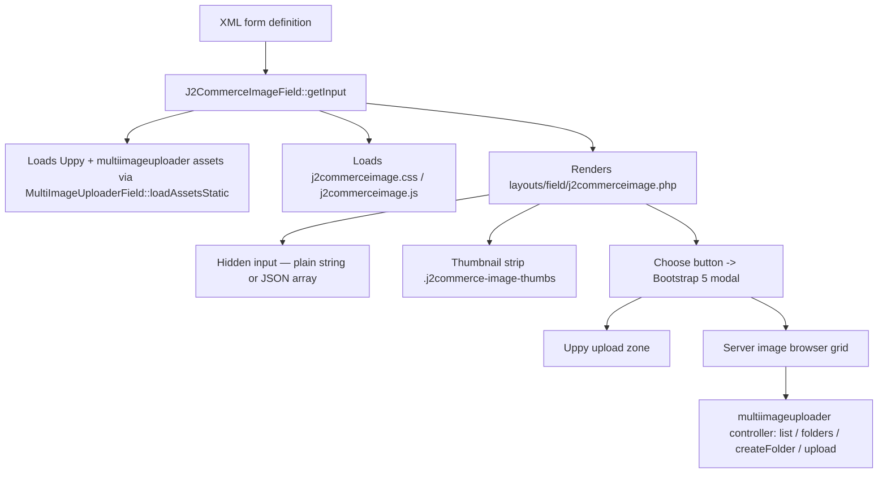

# J2CommerceImage Form Field

`J2CommerceImageField` is a lightweight inline image picker for J2Commerce admin forms. It renders a row of fixed-size thumbnails with an **Add Image** button that opens a Bootstrap 5 modal containing an Uppy upload zone and a server-side image browser. Unlike `MultiImageUploaderField`, which is a full-featured drag-and-drop gallery widget with sort handles, alt-text editing, and an image editor, `J2CommerceImageField` stays compact — it is suited for single-image fields (product thumbnail, brand logo) or small multi-image sets where the form needs to remain uncluttered.

## Architecture



## Key Classes

| Class | File | Purpose |
|-------|------|---------|
| `J2CommerceImageField` | `administrator/components/com_j2commerce/src/Field/J2CommerceImageField.php` | PHP form field — resolves attributes, normalizes value, renders layout |
| `MultiImageUploaderField` | `administrator/components/com_j2commerce/src/Field/MultiImageUploaderField.php` | Provides `loadAssetsStatic()` — shared Uppy bundle |
| `J2CommerceImagePicker` | `media/com_j2commerce/js/admin/j2commerceimage.js` | Vanilla JS class — modal, browser grid, Uppy init, thumbnail strip |

## XML Attributes

Declare these attributes directly on the `<field>` element in your form XML.

| Attribute | Type | Default | Description |
|-----------|------|---------|-------------|
| `multiple` | bool | `false` | Allow selecting more than one image. Single mode stores a plain string; multiple mode stores a JSON array. |
| `max` | int | `0` | Maximum images selectable when `multiple="true"`. `0` means unlimited. The choose button is hidden automatically once the cap is reached. |
| `thumbnail_height` | int | `80` | Height (and width) of the inline thumbnail squares in pixels. Sets the `--j2img-thumb-size` CSS custom property on the wrapper. |
| `directory` | string | `images` | Default directory opened in the image browser. Also sets the Uppy upload destination. Persisted per field via `sessionStorage`. |
| `max_file_size` | int | `0` | Maximum upload size in **MB**. `0` falls back to the component setting `image_max_file_size` (default 10 MB). |
| `client_compression` | bool | component setting | When `true`, the Uppy Compressor plugin converts uploads to WebP at 80% quality before sending. Falls back to `image_client_compression`. |
| `auto_thumbnail` | bool | component setting | When `true`, the server generates a thumbnail after upload. Falls back to `image_auto_thumbnail`. |
| `accept` | string | `image/*` | MIME type restriction passed to Uppy's `allowedFileTypes`. Use a comma-separated list for multiple types, e.g. `image/jpeg,image/png`. |
| `preview_style` | string | `square` | `square` renders thumbnails with `object-fit: cover` (fills the box). `contain` uses `object-fit: contain` (shows the full image with letterboxing). |

Standard Joomla `FormField` attributes (`label`, `description`, `required`, `disabled`, `readonly`, `filter`, `class`, `default`) also apply.

## Value Format

The field stores its value as a single hidden `<input type="hidden">`. The format differs between modes.

**Single mode** (`multiple="false"`, the default):

```
images/products/my-product.jpg
```

The value is a plain relative path string. An empty field stores an empty string.

**Multiple mode** (`multiple="true"`):

```json
["images/products/front.jpg","images/products/back.jpg"]
```

The value is a JSON-encoded array of path strings. An empty field stores `[]`.

When reading the value in PHP, check the mode and decode accordingly:

```php
// File: your-plugin-or-model.php

$rawValue = $form->getValue('my_image_field');

// Single
$imagePath = (string) $rawValue;

// Multiple
$images = json_decode((string) $rawValue, true) ?? [];
```

## Usage Examples

### Single Image Field

```xml
<!-- File: administrator/components/com_yourplugin/forms/item.xml -->

<field
    name="thumbnail"
    type="J2CommerceImage"
    addfieldprefix="J2Commerce\Component\J2commerce\Administrator\Field"
    label="COM_YOURPLUGIN_FIELD_THUMBNAIL_LABEL"
    description="COM_YOURPLUGIN_FIELD_THUMBNAIL_DESC"
    directory="images/products"
    thumbnail_height="100"
/>
```

### Multiple Images with a Cap

```xml
<field
    name="gallery"
    type="J2CommerceImage"
    addfieldprefix="J2Commerce\Component\J2commerce\Administrator\Field"
    label="COM_YOURPLUGIN_FIELD_GALLERY_LABEL"
    multiple="true"
    max="5"
    directory="images/gallery"
    thumbnail_height="80"
    preview_style="contain"
/>
```

### Inside a Subform

The field initialises via the `joomla:updated` DOM event, which Joomla fires each time a subform row is added. No extra wiring is needed.

```xml
<field name="slides" type="subform" multiple="true" layout="joomla.form.field.subform.repeatable">
    <form>
        <field
            name="image"
            type="J2CommerceImage"
            addfieldprefix="J2Commerce\Component\J2commerce\Administrator\Field"
            label="COM_YOURPLUGIN_FIELD_SLIDE_IMAGE_LABEL"
            directory="images/slides"
        />
        <field name="caption" type="text" label="COM_YOURPLUGIN_FIELD_CAPTION_LABEL" />
    </form>
</field>
```

### In a J2Commerce App Plugin XML

```xml
<!-- File: plugins/j2commerce/app_yourplugin/config.xml -->

<?xml version="1.0" encoding="UTF-8"?>
<config>
    <fields name="params">
        <fieldset name="basic" label="COM_PLUGINS_BASIC_FIELDSET_LABEL">
            <field
                name="logo"
                type="J2CommerceImage"
                addfieldprefix="J2Commerce\Component\J2commerce\Administrator\Field"
                label="PLG_J2COMMERCE_APP_YOURPLUGIN_FIELD_LOGO_LABEL"
                directory="images/plugins"
                thumbnail_height="64"
            />
        </fieldset>
    </fields>
</config>
```

## Registering the Field Namespace

Because `J2CommerceImageField` lives in the J2Commerce component namespace, any form that uses it outside that component must declare `addfieldprefix`. Add it either per-field (as in the examples above) or on the root `<form>` element:

```xml
<form addfieldprefix="J2Commerce\Component\J2commerce\Administrator\Field">
    <fieldset name="basic">
        <field name="image" type="J2CommerceImage" label="..." />
    </fieldset>
</form>
```

No additional service provider registration is required. Joomla's form system resolves the class through the PSR-4 autoloader.

## Comparison with `MultiImageUploader`

| Feature | `J2CommerceImage` | `MultiImageUploader` |
|---------|-------------------|----------------------|
| Primary use case | Compact inline picker, single or small set | Full product image gallery |
| Single-image mode | Yes (default) | No — always multiple |
| Sort / reorder | No | Yes — drag handles |
| Alt text editing | No | Yes |
| Image editor (crop/rotate) | No | Yes |
| Thumbnail strip | Inline in form row | Full grid within the field |
| Choose button hidden at cap | Yes | N/A |
| Suitable for subforms | Yes | Not recommended |
| Asset bundle | Shared Uppy bundle + own JS/CSS | Shared Uppy bundle + own JS/CSS |

Use `J2CommerceImage` when the form design calls for a compact single-image picker or a small curated set. Use `MultiImageUploader` for the product image gallery where sorting and alt-text management matter.

## CSS Customisation

All visual sizing is driven by a single CSS custom property set inline on the `.j2commerce-image-field` wrapper:

```css
--j2img-thumb-size: 80px;   /* set from thumbnail_height attribute */
```

Override it in your own stylesheet or inline via a Joomla form layout override:

```css
/* Make all image fields in a specific form larger */
#your-form .j2commerce-image-field {
    --j2img-thumb-size: 120px;
}
```

The `preview_style` attribute controls `object-fit`:

```css
/* default — square crop */
.j2commerce-image-thumb img {
    object-fit: cover;
}

/* preview_style="contain" — letterboxed */
.j2commerce-image-thumb.preview-contain img {
    object-fit: contain;
}
```

The remove button (×) appears on hover. Dark mode is handled automatically via `prefers-color-scheme: dark`.

## Asset Loading

`J2CommerceImageField::loadAssets()` calls `MultiImageUploaderField::loadAssetsStatic()` first (guarded by a static flag, so assets load only once per page), then registers its own assets:

| Asset name | File | Notes |
|------------|------|-------|
| `com_j2commerce.uppy.css` | `media/com_j2commerce/css/uppy/uppy.min.css` | Uppy base styles |
| `com_j2commerce.multiimageuploader.css` | `media/com_j2commerce/css/administrator/multiimageuploader.css` | Modal / browser grid styles |
| `com_j2commerce.uppy.js` | `media/com_j2commerce/js/uppy/uppy.min.js` | Uppy bundle |
| `com_j2commerce.multiimageuploader.js` | `media/com_j2commerce/js/admin/multiimageuploader.js` | Full uploader JS (deferred, type=module) |
| `com_j2commerce.j2commerceimage.css` | `media/com_j2commerce/css/administrator/j2commerceimage.css` | Thumbnail strip styles |
| `com_j2commerce.j2commerceimage.js` | `media/com_j2commerce/js/admin/j2commerceimage.js` | `J2CommerceImagePicker` class (deferred) |

Both `J2CommerceImage` and `MultiImageUploader` fields can appear on the same page without loading Uppy twice.

## JavaScript API

The `J2CommerceImagePicker` class is exposed on `window.J2CommerceImagePicker` for programmatic access. Each `.j2commerce-image-field` element stores its instance at `element._j2imgPicker`.

```javascript
// Get the picker instance for a specific field
const wrapper = document.getElementById('jform_thumbnail-wrapper');
const picker  = wrapper?._j2imgPicker;

// Read the current selection (array of paths)
console.log(picker.selectedPaths);

// Programmatically set a value and re-render
picker.selectedPaths = ['images/products/override.jpg'];
picker.updateHiddenInput();
picker.renderThumbnails();
picker.updateChooseButton();
```

The class also re-initialises on the `joomla:updated` event, so it works correctly inside repeatable subforms.

## Upload Endpoint

Uploads go through the shared `multiimageuploader` controller task:

```
POST index.php?option=com_j2commerce&task=multiimageuploader.upload&format=json
```

The `path` meta field sets the upload directory. `autoThumbnail=1` triggers server-side thumbnail generation. CSRF protection is appended automatically by the JS class.

## Related

- [MultiImageUploader Field](./multi-image-uploader-field.md) — Full product image gallery field
- [Image Settings](../configuration/image-settings.md) — Component-level `image_max_file_size`, `image_client_compression`, `image_auto_thumbnail` parameters
