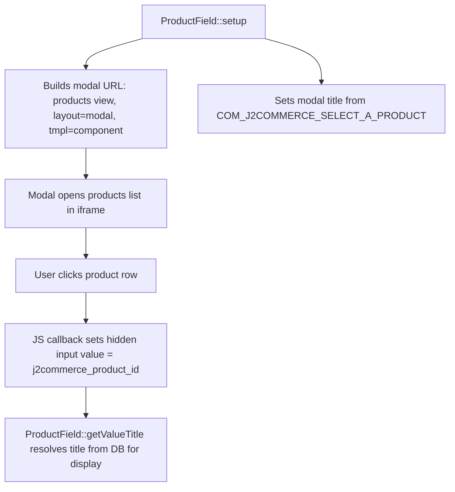

# Modal\\Product Form Field

`Modal\ProductField` extends Joomla's core `ModalSelectField` to provide a single-product picker backed by the J2Commerce `products` list view in modal layout. The field opens a component-only iframe (`tmpl=component`) so the user can search and select one product; the product title is then reflected in the field's display input. The selected value stored in the hidden input is the `j2commerce_product_id`.

## Key Classes

| Class | File | Purpose |
|-------|------|---------|
| `ProductField` | `administrator/components/com_j2commerce/src/Field/Modal/ProductField.php` | Configures modal URL, title, and value resolution |
| `ModalSelectField` | Joomla core | Base class — renders the button, modal shell, and hidden/display inputs |
| `FileLayout` | Joomla core | Renders the field layout; set to component `com_j2commerce`, client 1 |

## Architecture



## Modal URL

```
/administrator/index.php
  ?option=com_j2commerce
  &view=products
  &layout=modal
  &tmpl=component
  &{csrf_token}=1
  [&forcedLanguage={language}]
```

The CSRF token is appended automatically via `Session::getFormToken()`.

## Value Format

The field stores a single integer: the `j2commerce_product_id`. If the value arrives as <code><strong style={{color: '#6f42c1'}}>id</strong>:<strong style={{color: '#6f42c1'}}>alias</strong></code> (e.g. from a URL parameter), `setup()` strips the alias before calling `parent::setup()`.

## Title Resolution

`getValueTitle()` joins `#__j2commerce_products` with `#__content` to fetch the article title for display:

```sql
SELECT c.title
FROM #__j2commerce_products AS p
LEFT JOIN #__content AS c ON p.product_source_id = c.id
WHERE p.j2commerce_product_id = :value
  AND p.product_source = 'com_content'
```

If no title is found, the numeric ID is shown as a fallback.

## XML Usage

```xml
<!-- File: administrator/components/com_j2commerce/forms/coupon.xml (example) -->

<form addfieldprefix="J2Commerce\Component\J2commerce\Administrator\Field\Modal">
    <fieldset name="products">
        <field
            name="product_id"
            type="Modal_Product"
            label="COM_J2COMMERCE_FIELD_PRODUCT_LABEL"
            description="COM_J2COMMERCE_FIELD_PRODUCT_DESC"
        />
    </fieldset>
</form>
```

### XML Attributes

| Attribute | Type | Default | Description |
|-----------|------|---------|-------------|
| `type` | string | — | Must be `Modal_Product` |
| `language` | string | — | Force a specific content language in the modal (`forcedLanguage` URL parameter). Also appends the language name to the modal title. |
| `propagate` | bool | `false` | Enable propagate action (requires more than 2 content languages). |
| `required` | bool | `false` | Mark field as required |
| `readonly` | bool | `false` | Disable the select button |

All standard `ModalSelectField` attributes (`label`, `description`, `hint`, `class`, `filter`) also apply.

## Namespace Registration

The `Modal` subdirectory requires the full namespace path in `addfieldprefix`:

```xml
<form addfieldprefix="J2Commerce\Component\J2commerce\Administrator\Field\Modal">
```

Or scope it per-field:

```xml
<field
    name="product_id"
    type="Modal_Product"
    addfieldprefix="J2Commerce\Component\J2commerce\Administrator\Field\Modal"
    label="..."
/>
```

## Usage in Plugin Forms

Use this field in app plugin forms that need to target a specific product:

```xml
<!-- File: plugins/j2commerce/app_yourplugin/config.xml -->

<?xml version="1.0" encoding="UTF-8"?>
<config>
    <fields name="params">
        <fieldset name="basic" label="COM_PLUGINS_BASIC_FIELDSET_LABEL">
            <field
                name="featured_product_id"
                type="Modal_Product"
                addfieldprefix="J2Commerce\Component\J2commerce\Administrator\Field\Modal"
                label="PLG_J2COMMERCE_APP_YOURPLUGIN_FIELD_FEATURED_PRODUCT_LABEL"
                description="PLG_J2COMMERCE_APP_YOURPLUGIN_FIELD_FEATURED_PRODUCT_DESC"
            />
        </fieldset>
    </fields>
</config>
```

Reading the value in the plugin PHP class:

```php
// File: plugins/j2commerce/app_yourplugin/src/Extension/AppYourPlugin.php

$productId = (int) $this->params->get('featured_product_id', 0);
```

## Comparison with ProductMultiSelectField

| Feature | `Modal_Product` | `Modal_ProductMultiselect` |
|---------|-----------------|---------------------------|
| Selection | Single product | Multiple products |
| Stored value | Integer ID | Comma-separated IDs / array |
| Modal layout | `layout=modal` | `layout=modal_multiselect` |
| Table display | No | Yes — shows selected products in a table |
| Base class | `ModalSelectField` | `ModalMultiSelectField` |

## Related

- [Modal\\ProductMultiSelect Field](./modal-product-multiselect-field.md) — Multiple product picker variant
- [Products View](../features/products/index.md) — The list view that powers the modal
