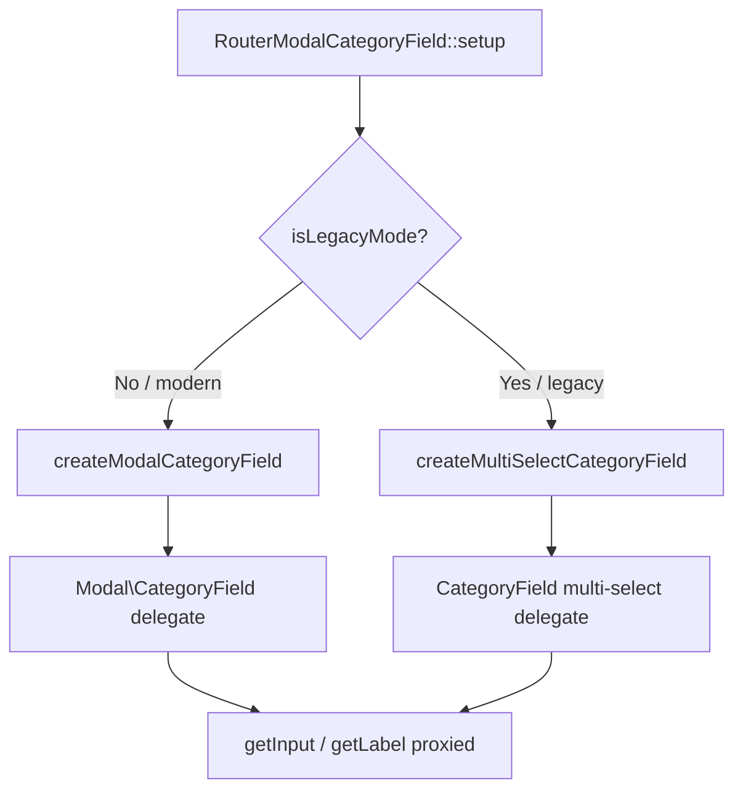

# RouterModalCategoryField

`RouterModalCategoryField` is a **delegating** field that creates and proxies a different underlying Joomla form field depending on the active `sef_router` component setting:

- **`modern` router** — delegates to `Joomla\Component\Categories\Administrator\Field\Modal\CategoryField` (the Joomla Categories modal picker with create/edit/clear buttons).
- **`legacy` router** — delegates to `Joomla\CMS\Form\Field\CategoryField` with `multiple = true` and the `joomla.form.field.list-fancy-select` layout.

## Class Details

| Property | Value |
|----------|-------|
| **Class** | `RouterModalCategoryField` |
| **Namespace** | `J2Commerce\Component\J2commerce\Administrator\Field` |
| **File** | `administrator/components/com_j2commerce/src/Field/RouterModalCategoryField.php` |
| **Extends** | `Joomla\CMS\Form\FormField` |
| **Field type string** | `RouterModalCategory` |
| **Since** | 6.0.8 |

## Architecture



The delegate field is stored in `$this->delegateField`. Both `getInput()` and `getLabel()` proxy to `$this->delegateField->__get('input')` and `->__get('label')` respectively.

## Dependency Injection for Delegated Fields

Joomla's `Form::loadField()` normally injects database and user dependencies into field instances. Because delegate fields are created manually (bypassing `Form::loadField()`), `RouterModalCategoryField::injectFieldDependencies()` performs this injection explicitly:

```php
protected function injectFieldDependencies(FormField $field): void
{
    if ($field instanceof DatabaseAwareInterface) {
        $field->setDatabase($this->getDatabase());
    }

    if ($field instanceof CurrentUserInterface) {
        $field->setCurrentUser($this->getCurrentUser());
    }
}
```

## Value Migration (Legacy → Modern)

When switching from `legacy` (array of category IDs) to `modern` (single ID), the field automatically converts the stored array value to a scalar by taking `reset($value)`:

```php
if (is_array($value)) {
    $value = !empty($value) ? (string) reset($value) : '';
}
```

## XML Usage

```xml
<form addfieldprefix="J2Commerce\Component\J2commerce\Administrator\Field">
    <fieldset name="basic">
        <field
            name="catid"
            type="RouterModalCategory"
            label="JGLOBAL_CHOOSE_CATEGORY_LABEL"
            extension="com_content"
            required="false"
        />
    </fieldset>
</form>
```

## XML Attributes

| Attribute | Required | Description |
|-----------|----------|-------------|
| `name` | Yes | Field name. Single string in modern mode; submitted as `name[]` in legacy mode. |
| `type` | Yes | Must be `RouterModalCategory`. |
| `label` | No | Language key forwarded to the delegate field. Defaults to `JGLOBAL_CHOOSE_CATEGORY_LABEL`. |
| `extension` | No | Category extension filter. Defaults to `com_content`. |
| `required` | No | Forwarded to the delegate field. |

The `multiple` attribute is always set by the field itself and must not be specified in XML.

## Delegate Field Attributes (Modern Mode)

The `modal_category` delegate is created with `select="true"`, `new="true"`, `edit="true"`, `clear="true"` — giving the admin the full modal create/edit/clear experience.

## Router Mode Detection

```php
protected function isLegacyMode(): bool
{
    $params    = ComponentHelper::getParams('com_j2commerce');
    $sefRouter = $params->get('sef_router', 'modern');

    return $sefRouter === 'legacy';
}
```

## Related

- [RouterCategoryField](./router-category-field.md) — Simpler router-aware category field extending CategoryField directly
- [RoutertypeField](./routertype-field.md) — Hidden field for `showon` conditions based on router type
