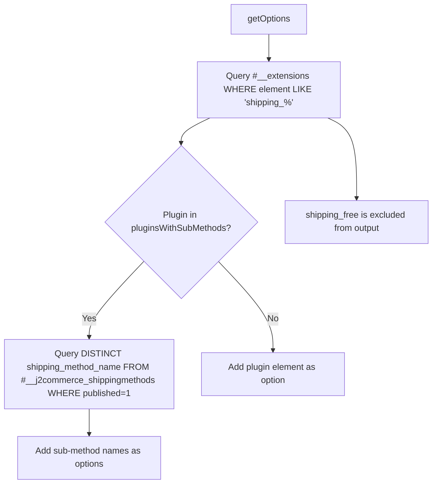

# ShippingMethods Form Field

`ShippingMethodsField` is a `ListField` subclass that queries `#__extensions` for all enabled plugins in the `j2commerce` group whose element name begins with `shipping_`. It also resolves sub-methods from `#__j2commerce_shippingmethods` for plugins that store named rates in that table. Each plugin's own language file is loaded before its label is translated.

## Key Classes

| Class | File | Purpose |
|-------|------|---------|
| `ShippingMethodsField` | `administrator/components/com_j2commerce/src/Field/ShippingMethodsField.php` | Queries plugins and sub-methods; loads language files |

## Architecture



## Database Queries

### Plugin Query

```sql
SELECT element AS value, name AS text
FROM #__extensions
WHERE type     = 'plugin'
  AND folder   = 'j2commerce'
  AND element  LIKE 'shipping_%'
  AND enabled  = 1
ORDER BY name ASC
```

### Sub-Methods Query

Executed once when at least one sub-method plugin is detected:

```sql
SELECT DISTINCT shipping_method_name
FROM #__j2commerce_shippingmethods
WHERE published = 1
```

## Plugins with Sub-Methods

The following plugin elements cause the field to substitute the plugin option with named sub-method entries from `#__j2commerce_shippingmethods`:

| Plugin element | Description |
|----------------|-------------|
| `shipping_standard` | Standard flat-rate with named methods |
| `shipping_postcode` | Postcode-based rate lookup |
| `shipping_additional` | Per-item additional charge |
| `shipping_incremental` | Incremental weight-based pricing |
| `shipping_flatrate_advanced` | Advanced flat rate with conditions |

For all other enabled shipping plugins (e.g. `shipping_ups`, `shipping_fedex`), the plugin element itself is used as the option value.

## Excluded Plugins

`shipping_free` is always excluded from the dropdown. Free shipping is applied by rule conditions, not by direct method selection.

## Per-Plugin Language Loading

```php
$lang->load('plg_j2commerce_' . $plugin->value, JPATH_PLUGINS . '/j2commerce/' . $plugin->value);
```

The language file must exist at `plugins/j2commerce/{element}/language/en-GB/plg_j2commerce_{element}.ini`. If absent, the raw language constant appears in the dropdown.

## XML Usage

```xml
<!-- File: administrator/components/com_j2commerce/forms/coupon.xml (example) -->

<form addfieldprefix="J2Commerce\Component\J2commerce\Administrator\Field">
    <fieldset name="restrictions">
        <field
            name="shipping_method"
            type="ShippingMethods"
            label="COM_J2COMMERCE_FIELD_SHIPPING_METHOD_LABEL"
            description="COM_J2COMMERCE_FIELD_SHIPPING_METHOD_DESC"
        />
    </fieldset>
</form>
```

### XML Attributes

| Attribute | Type | Default | Description |
|-----------|------|---------|-------------|
| `type` | string | — | Must be `ShippingMethods` |
| `multiple` | bool | `false` | Allow selecting more than one method |
| `required` | bool | `false` | Mark field as required |
| `default` | string | — | Pre-selected value |

Static `<option>` elements in the XML are prepended via `parent::getOptions()`.

## Error Handling

Database exceptions are caught and an admin error message is displayed using `COM_J2COMMERCE_ERROR_LOADING_SHIPPING_METHODS`. The dropdown falls back to any static options defined in the XML.

## Usage in Plugin Forms

Use this field in any plugin that restricts behaviour to a specific shipping method — for example, a gift wrapping plugin that should only activate for standard shipping:

```xml
<!-- File: plugins/j2commerce/app_yourplugin/config.xml -->

<?xml version="1.0" encoding="UTF-8"?>
<config>
    <fields name="params">
        <fieldset name="basic" label="COM_PLUGINS_BASIC_FIELDSET_LABEL">
            <field
                name="excluded_shipping_methods"
                type="ShippingMethods"
                addfieldprefix="J2Commerce\Component\J2commerce\Administrator\Field"
                label="PLG_J2COMMERCE_APP_YOURPLUGIN_FIELD_EXCLUDED_SHIPPING_LABEL"
                description="PLG_J2COMMERCE_APP_YOURPLUGIN_FIELD_EXCLUDED_SHIPPING_DESC"
                multiple="true"
            />
        </fieldset>
    </fields>
</config>
```

## Adding a Custom Shipping Plugin to Sub-Methods

If you build a shipping plugin that stores its rates in `#__j2commerce_shippingmethods`, add your plugin element to the `$pluginsWithSubMethods` array by overriding the field — or contribute a PR. The sub-method query is performed only once per page regardless of how many sub-method plugins are active.

## Related

- [PaymentMethods Field](./payment-methods-field.md) — Equivalent field for payment plugins
- [Shipping Plugin API](../extensions/plugins/shipping-plugins.md) — Building J2Commerce shipping plugins
- [Dimensions Field](./dimensions-field.md) — Composite dimension input used on variant forms
