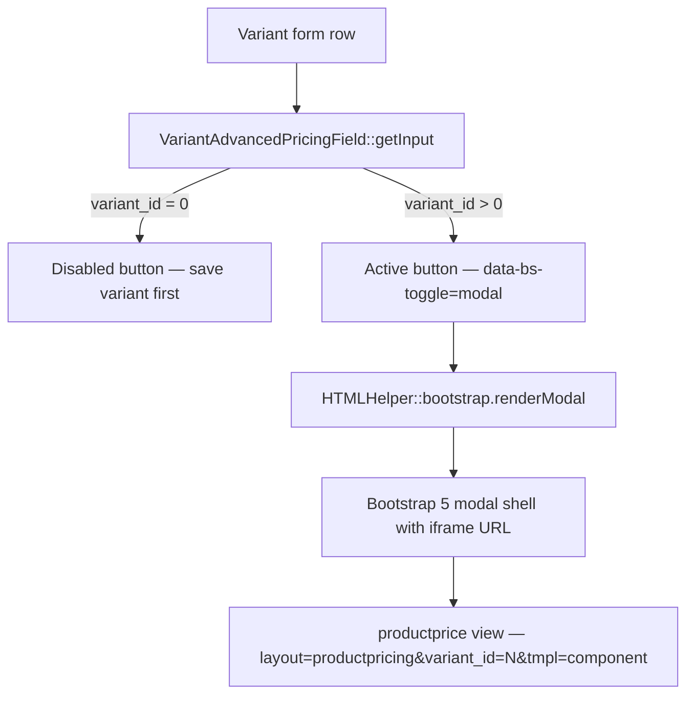

# VariantAdvancedPricing Form Field

`VariantAdvancedPricingField` is a `FormField` subclass that renders a button linking to the advanced pricing modal for a specific product variant. When clicked, the button opens a Bootstrap 5 modal containing an iframe pointed at the `productprice` view (`layout=productpricing`). For new (unsaved) variants where no `variant_id` is available yet, the field renders a disabled button instead.

## Key Classes

| Class | File | Purpose |
|-------|------|---------|
| `VariantAdvancedPricingField` | `administrator/components/com_j2commerce/src/Field/VariantAdvancedPricingField.php` | Renders button + Bootstrap modal shell |

## Architecture



## Variant ID Extraction

The field name in a variant subform follows the pattern:

```
jform[attribs][j2commerce][variable][variant_id][advanced_pricing]
```

`getInput()` extracts the `variant_id` segment with a regex:

```php
preg_match('/\[variable\]\[(\d+)\]/', $this->name, $matches);
```

If the match fails (e.g. for a freshly-added row with `variant_id = 0`), the field degrades to a disabled button with the tooltip text from `COM_J2COMMERCE_SAVE_VARIANT_FIRST`.

## Modal Configuration

The modal is rendered via `HTMLHelper::_('bootstrap.renderModal', ...)` with these parameters:

| Parameter | Value |
|-----------|-------|
| `url` | `administrator/index.php?option=com_j2commerce&view=productprice&layout=productpricing&variant_id=`<strong style={{color: '#6f42c1'}}>N</strong>`&tmpl=component` |
| `title` | `COM_J2COMMERCE_PRODUCT_ADDITIONAL_PRICING` |
| `height` | `100%` |
| `width` | `100%` |
| `modalWidth` | `95%` |
| `bodyHeight` | `95%` |
| Footer button | Close (`JLIB_HTML_BEHAVIOR_CLOSE`) |

Each modal has a unique DOM id: `variantPriceModal_`<strong style={{color: '#6f42c1'}}>variant_id</strong>.

## XML Usage

The field is used directly in the variant sub-form definition and requires no extra configuration:

```xml
<!-- File: administrator/components/com_j2commerce/forms/variant.xml (example) -->

<form addfieldprefix="J2Commerce\Component\J2commerce\Administrator\Field">
    <fieldset name="pricing">
        <field
            name="advanced_pricing"
            type="VariantAdvancedPricing"
            label="COM_J2COMMERCE_FIELD_VARIANT_ADVANCED_PRICING_LABEL"
        />
    </fieldset>
</form>
```

### XML Attributes

| Attribute | Type | Default | Description |
|-----------|------|---------|-------------|
| `type` | string | — | Must be `VariantAdvancedPricing` |
| `label` | string | — | Field label shown in the form row |

The field does not store a value — it is purely a UI trigger. No `filter`, `required`, or `default` attributes are meaningful here.

## Disabled State

When the variant has not yet been saved (`variant_id = 0`), the rendered HTML is:

```html
<button type="button" class="btn btn-secondary btn-sm" disabled
        title="Save the variant first before setting additional pricing.">
    Additional Pricing
</button>
```

The tooltip text resolves from `COM_J2COMMERCE_SAVE_VARIANT_FIRST`.

## Usage in Plugin Forms

This field is not typically used in plugin configuration forms. Its purpose is specific to the variant editing workflow. If a custom product type plugin introduces its own variant editor, include this field to give users access to the advanced pricing rules for each variant:

```xml
<!-- File: plugins/j2commerce/app_yourproducttype/forms/variant.xml -->

<form addfieldprefix="J2Commerce\Component\J2commerce\Administrator\Field">
    <fieldset name="pricing">
        <field
            name="price"
            type="VariantPrice"
            label="PLG_J2COMMERCE_APP_YOURPRODUCTTYPE_FIELD_PRICE_LABEL"
            filter="float"
        />
        <field
            name="advanced_pricing"
            type="VariantAdvancedPricing"
            label="PLG_J2COMMERCE_APP_YOURPRODUCTTYPE_FIELD_ADVANCED_PRICING_LABEL"
        />
    </fieldset>
</form>
```

## Related

- [VariantPrice Field](./variant-price-field.md) — Currency-prefixed price input used alongside this field
- [Advanced Pricing](../features/products/advanced-pricing.md) — Price rule architecture and the `productprice` view
