# Dompdf PDF Generation

The J2Commerce Dompdf Library bundles [dompdf v3.1.5](https://github.com/dompdf/dompdf) as a Joomla installable library extension. It converts HTML and CSS into PDF documents and is the recommended approach for generating invoices, gift certificates, packing slips, and any other printable output from J2Commerce extensions.

The library ships as a separate add-on available from the [J2Commerce Extensions Store](https://www.j2commerce.com). It is not included with the core J2Commerce 6 component.

Two usage paths are available:

- **`PdfFactory`** (recommended) — a thin wrapper at `J2Commerce\Library\Dompdf\PdfFactory` that pre-configures Joomla-aware defaults and manages autoloader loading
- **Direct `Dompdf\Dompdf`** — access the underlying dompdf class directly for full control over every option

## Architecture

```mermaid
graph TD
    A["Extension (plugin/module)"] --> B["PdfFactory::create()"]
    A --> C["PdfFactory::ensureAutoloaded() + new Dompdf(&#123;Options&#125;)"]
    B --> D["Dompdf instance"]
    C --> D
    D --> E["loadHtml()"]
    E --> F["render()"]
    F --> G["output() — PDF string"]
    F --> H["stream() — HTTP response"]
    G --> I["File::write() — save to disk"]
    G --> J["Mailer::addAttachment() — email"]
```



## Key Classes

| Class | Namespace | Purpose |
|-------|-----------|---------|
| `PdfFactory` | `J2Commerce\Library\Dompdf` | Joomla-aware factory: autoloader, defaults, availability check |
| `Dompdf` | `Dompdf` | Core dompdf renderer — HTML to PDF |
| `Options` | `Dompdf` | Configuration container for a `Dompdf` instance |

## Installation

This library is a separate add-on available from the [J2Commerce Extensions Store](https://www.j2commerce.com). It is not included with the core J2Commerce 6 component.

1. Purchase and download the `lib_dompdf.zip` package from the J2Commerce website.
2. Go to **System** -> **Install** -> **Extensions**.
3. Upload the `lib_dompdf.zip` package file.
4. The library installs automatically and creates the temp directory at `JPATH_ROOT/tmp/dompdf/`.

The install script enforces PHP >= 8.1.0 and Joomla >= 5.0.0. If either requirement is not met, installation is blocked.

On uninstall, the `tmp/dompdf/` directory is removed.

### Verify Installation

```php
// File: your-plugin/src/Extension/YourPlugin.php

use J2Commerce\Library\Dompdf\PdfFactory;

if (!PdfFactory::isAvailable()) {
    // Library not installed — show a notice or skip PDF generation
    return;
}
```

Alternatively, the gift certificate plugin demonstrates a form field pattern that displays an admin badge:

```php
// File: plugins/j2commerce/app_giftcertificate/src/Field/PdfcheckField.php

$dompdf_available = is_dir(Path::clean(JPATH_LIBRARIES . '/dompdf'));
```

Both approaches confirm the same thing: whether `libraries/dompdf/vendor/autoload.php` exists on disk.

## Method 1: PdfFactory (Recommended)

`PdfFactory` is the recommended entry point. It handles autoloader bootstrapping exactly once per request, sets sensible Joomla-aware defaults (temp dir, font cache, security options), and returns a configured `Dompdf` instance ready to use.

### Default Configuration Applied by PdfFactory

| Option | Default Value | Notes |
|--------|--------------|-------|
| `tempDir` | `JPATH_ROOT/tmp/dompdf` | Must be writable |
| `fontDir` | `JPATH_ROOT/tmp/dompdf` | Font metrics stored here |
| `fontCache` | `JPATH_ROOT/tmp/dompdf` | Font cache stored here |
| `isFontSubsettingEnabled` | `true` | Reduces PDF file size |
| `isRemoteEnabled` | `false` | Remote HTTP requests disabled for security |
| `isHtml5ParserEnabled` | `true` | Use the HTML5 parser |
| `logOutputFile` | `JPATH_ROOT/tmp/dompdf/dompdf_log.html` | Debug log |
| Paper | `A4` | Passed as second argument |
| Orientation | `portrait` | Passed as third argument |

### Basic PDF Generation — Get String Output

```php
// File: plugins/j2commerce/your_plugin/src/Model/YourModel.php

declare(strict_types=1);

namespace J2Commerce\Plugin\J2Commerce\YourPlugin\Model;

use J2Commerce\Library\Dompdf\PdfFactory;
use Joomla\Filesystem\File;

\defined('_JEXEC') or die;

class YourModel
{
    public function generatePdf(string $html): string
    {
        $dompdf = PdfFactory::create();
        $dompdf->loadHtml($html);
        $dompdf->render();

        return $dompdf->output();
    }
}
```

### Saving a PDF to Disk

```php
// File: plugins/j2commerce/your_plugin/src/Model/YourModel.php

use J2Commerce\Library\Dompdf\PdfFactory;
use Joomla\Filesystem\File;
use Joomla\Filesystem\Folder;
use Joomla\Filesystem\Path;

public function savePdf(string $html, string $filename): bool
{
    $outputDir = JPATH_SITE . '/media/j2commerce/invoices';

    if (!is_dir(Path::clean($outputDir))) {
        Folder::create($outputDir);
    }

    $dompdf = PdfFactory::create();
    $dompdf->loadHtml($html);
    $dompdf->render();

    $pdfContent = $dompdf->output();
    $filePath   = $outputDir . '/' . $filename;

    if (is_file(Path::clean($filePath))) {
        File::delete($filePath);
    }

    return File::write($filePath, $pdfContent);
}
```

### Streaming a PDF to the Browser

Call `stream()` after `render()` to send the PDF directly to the browser, then exit. The `Attachment` option controls whether the browser prompts a download (`true`) or attempts to display inline (`false`).

```php
// File: plugins/j2commerce/your_plugin/src/Extension/YourPlugin.php

use J2Commerce\Library\Dompdf\PdfFactory;
use Joomla\CMS\Factory;

public function streamPdfToBrowser(string $html, string $filename): void
{
    $dompdf = PdfFactory::create();
    $dompdf->loadHtml($html);
    $dompdf->render();

    // stream() sends HTTP headers and PDF body, then exits
    $dompdf->stream($filename, ['Attachment' => false]);
    Factory::getApplication()->close();
}
```

For a download prompt instead of inline display, set `'Attachment' => true`.

### Custom Paper Size and Orientation

Pass the paper size and orientation as the second and third arguments to `PdfFactory::create()`. Any size supported by dompdf is valid, including named sizes (`'A4'`, `'letter'`, `'legal'`) and custom dimensions as a four-element array in points.

```php
// A4 landscape
$dompdf = PdfFactory::create(null, 'A4', 'landscape');

// US Letter portrait (default)
$dompdf = PdfFactory::create(null, 'letter', 'portrait');

// Custom size: 200mm x 100mm expressed in points (1pt = 1/72 inch)
// 200mm = 566.93pt, 100mm = 283.46pt
$dompdf = PdfFactory::create(null, [0, 0, 283.46, 566.93], 'portrait');
```

### Enabling Remote Images

By default `PdfFactory` disables remote HTTP/HTTPS resource loading for security. Enable it only when the HTML content originates from a trusted internal source.

```php
use Dompdf\Options;
use J2Commerce\Library\Dompdf\PdfFactory;

$options = new Options();
$options->setTempDir(JPATH_ROOT . '/tmp/dompdf');
$options->setFontDir(JPATH_ROOT . '/tmp/dompdf');
$options->setFontCache(JPATH_ROOT . '/tmp/dompdf');
$options->setIsFontSubsettingEnabled(true);
$options->setIsRemoteEnabled(true);  // allow external image URLs

$dompdf = PdfFactory::create($options, 'A4', 'portrait');
$dompdf->loadHtml($html);
$dompdf->render();
```

Passing a non-null `Options` object overrides all defaults entirely. Include every option you need; the factory does not merge with defaults when a custom `Options` is passed.

### Checking Availability Before Use

Always guard PDF generation paths in plugins that declare the library as optional:

```php
use J2Commerce\Library\Dompdf\PdfFactory;

if (!PdfFactory::isAvailable()) {
    Factory::getApplication()->enqueueMessage(
        'PDF generation requires the Dompdf Library. Please install it from the J2Commerce Extensions Store.',
        'warning'
    );
    return;
}

$dompdf = PdfFactory::create();
// ... generate PDF
```

## Method 2: Direct Dompdf

Use the underlying `Dompdf\Dompdf` class directly when you need precise control over every option or when the factory defaults are not appropriate for your use case.

Call `PdfFactory::ensureAutoloaded()` first to register the Composer autoloader. This is safe to call multiple times — it uses a static flag to load the autoloader exactly once per request.

```php
// File: plugins/j2commerce/your_plugin/src/Model/YourModel.php

declare(strict_types=1);

namespace J2Commerce\Plugin\J2Commerce\YourPlugin\Model;

use Dompdf\Dompdf;
use Dompdf\Options;
use J2Commerce\Library\Dompdf\PdfFactory;

\defined('_JEXEC') or die;

class YourModel
{
    public function generateCustomPdf(string $html): string
    {
        // Register the Composer autoloader before using Dompdf\ classes
        PdfFactory::ensureAutoloaded();

        $options = new Options();
        $options->setTempDir(JPATH_ROOT . '/tmp/dompdf');
        $options->setFontDir(JPATH_ROOT . '/tmp/dompdf');
        $options->setFontCache(JPATH_ROOT . '/tmp/dompdf');
        $options->setIsFontSubsettingEnabled(true);
        $options->setIsRemoteEnabled(false);
        $options->set('isHtml5ParserEnabled', true);
        $options->setDpi(150);

        $dompdf = new Dompdf($options);
        $dompdf->setPaper('A4', 'portrait');
        $dompdf->loadHtml($html);
        $dompdf->render();

        return $dompdf->output();
    }
}
```

### When to Use Direct vs Factory

Use `PdfFactory::create()` when:

- Generating standard documents (invoices, certificates, packing slips)
- You want the Joomla-aware defaults without boilerplate
- You only need to override paper size or orientation

Use direct `Dompdf` when:

- You need to change DPI, default font, media type, or other options not exposed by the factory
- You are embedding PDF generation in a long-running process and need fine-grained memory control
- You need access to dompdf's `Canvas` API or callback hooks

## Integration with J2Commerce Extensions

### Plugin Pattern (App Plugin)

The following pattern shows how a J2Commerce app plugin checks availability, generates a PDF, and attaches it to an order email. This mirrors the `app_giftcertificate` implementation.

```php
// File: plugins/j2commerce/your_plugin/src/Extension/YourPlugin.php

declare(strict_types=1);

namespace J2Commerce\Plugin\J2Commerce\YourPlugin\Extension;

use J2Commerce\Library\Dompdf\PdfFactory;
use Joomla\CMS\Plugin\CMSPlugin;
use Joomla\Event\SubscriberInterface;
use Joomla\Filesystem\File;
use Joomla\Filesystem\Folder;
use Joomla\Filesystem\Path;

\defined('_JEXEC') or die;

final class YourPlugin extends CMSPlugin implements SubscriberInterface
{
    public static function getSubscribedEvents(): array
    {
        return [
            'onJ2CommerceOrderEmailPrepare' => 'attachPdfToEmail',
        ];
    }

    public function attachPdfToEmail(\Joomla\Event\Event $event): void
    {
        if (!PdfFactory::isAvailable()) {
            return;
        }

        $order  = $event->getArgument('order');
        $mailer = $event->getArgument('mailer');

        $html     = $this->buildHtml($order);
        $pdfPath  = $this->savePdf($html, 'order_' . $order->order_id . '.pdf');

        if ($pdfPath !== null) {
            $mailer->addAttachment($pdfPath);
        }
    }

    private function buildHtml(object $order): string
    {
        return '<!DOCTYPE html><html><head>'
            . '<meta charset="UTF-8">'
            . '</head><body>'
            . '<h1>Order #' . htmlspecialchars((string) $order->order_id, ENT_QUOTES, 'UTF-8') . '</h1>'
            . '</body></html>';
    }

    private function savePdf(string $html, string $filename): ?string
    {
        $dir = JPATH_SITE . '/media/j2commerce/invoices';

        if (!is_dir(Path::clean($dir))) {
            Folder::create($dir);
        }

        $dompdf = PdfFactory::create();
        $dompdf->loadHtml($html);
        $dompdf->render();

        $path = $dir . '/' . $filename;

        if (is_file(Path::clean($path))) {
            File::delete($path);
        }

        return File::write($path, $dompdf->output()) ? $path : null;
    }
}
```

### Declaring the Library Dependency

In your plugin's `preflight()` installer script, warn the user if the library is not present. Do not block installation — the plugin may have non-PDF features that work without the library.

```php
// File: plugins/j2commerce/your_plugin/script.your_plugin.php

use Joomla\CMS\Factory;
use Joomla\Filesystem\Path;

public function preflight(string $type, object $parent): bool
{
    if (!is_dir(Path::clean(JPATH_LIBRARIES . '/dompdf'))) {
        Factory::getApplication()->enqueueMessage(
            'PDF generation features require the Dompdf Library. Install it from the J2Commerce Extensions Store.',
            'notice'
        );
    }

    return true;
}
```

## Configuration Reference

### `Options` Methods Commonly Used

| Method | Type | Description |
|--------|------|-------------|
| `setTempDir(string $dir)` | string | Writable directory for temporary files |
| `setFontDir(string $dir)` | string | Directory where font metrics are stored |
| `setFontCache(string $dir)` | string | Directory for cached font data (may equal `fontDir`) |
| `setIsRemoteEnabled(bool $enabled)` | bool | Allow loading remote HTTP/HTTPS resources |
| `setIsFontSubsettingEnabled(bool $enabled)` | bool | Embed only used glyphs — reduces file size |
| `set('isHtml5ParserEnabled', bool)` | bool | Use the HTML5 parser (recommended) |
| `setDpi(int $dpi)` | int | Image DPI (default: 96) |
| `setDefaultFont(string $font)` | string | Fallback font family (default: `'serif'`) |
| `setLogOutputFile(string $path)` | string | Debug log file path |
| `setChroot(array $dirs)` | array | Restrict local file access to these directories |

### `Dompdf` Methods Used in Generation

| Method | Description |
|--------|-------------|
| `loadHtml(string $html, ?string $encoding)` | Parse and load HTML string |
| `setPaper(string\|array $paper, string $orientation)` | Set paper size and orientation |
| `render()` | Lay out the document and produce the PDF |
| `output(?array $options)` | Return the rendered PDF as a string |
| `stream(string $filename, ?array $options)` | Send PDF to browser with HTTP headers |

### `stream()` Options

| Key | Type | Default | Description |
|-----|------|---------|-------------|
| `Attachment` | bool | `true` | `true` = download prompt; `false` = inline display |

## Troubleshooting

### Blank or Corrupted PDF Output

**Cause:** HTML passed to `loadHtml()` contains invalid markup that confuses the layout engine.

**Solution:** Use PHP's `tidy_repair_string()` to normalize the HTML before passing it to dompdf. Check that the document has a `<!DOCTYPE html>` declaration and a `<meta charset="UTF-8">` tag inside `<head>`.

```php
if (function_exists('tidy_repair_string')) {
    $config  = ['output-html' => 'yes', 'char-encoding' => 'utf8', 'wrap' => 0];
    $cleaned = tidy_repair_string($html, $config, 'utf8');

    if ($cleaned !== false) {
        $html = $cleaned;
    }
}

$dompdf->loadHtml($html);
```

### Images Not Appearing in PDF

**Cause:** Remote images require `isRemoteEnabled = true`. Local images must use absolute filesystem paths, not site-relative URLs.

**Solution 1 — Local images:** Replace relative URLs (`/images/logo.png`) with absolute filesystem paths (`file:///var/www/html/images/logo.png`) or absolute web URLs if remote loading is enabled.

**Solution 2 — Inline base64:** Embed images as data URIs to avoid any remote or path issues:

```php
$imageData   = file_get_contents(JPATH_ROOT . '/images/logo.png');
$base64Image = 'data:image/png;base64,' . base64_encode($imageData);
$html        = '';
```

**Solution 3 — Enable remote loading** (for trusted, internal sources only):

```php
$options = new Options();
// ... other options ...
$options->setIsRemoteEnabled(true);
$dompdf = PdfFactory::create($options);
```

### Font Rendering Problems / Missing Characters

**Cause:** The font directory is not writable, so dompdf cannot cache font metrics on first use.

**Solution:** Ensure `JPATH_ROOT/tmp/dompdf/` exists and is writable by the web server. The library's install script creates this directory automatically with mode `0755`. Verify it with:

```php
var_dump(is_writable(JPATH_ROOT . '/tmp/dompdf'));
```

For non-Latin scripts (Arabic, Chinese, Japanese), use a font that supports the required character set and register it with dompdf's `FontMetrics` before calling `render()`.

### Memory Limit Exceeded

**Cause:** Large documents, many images, or high DPI settings require significant memory. Dompdf loads the entire document into memory during layout.

**Solution:** Increase PHP memory limit for the PDF generation request, reduce image resolution, or split large documents into multiple smaller PDFs:

```php
$previousLimit = ini_set('memory_limit', '256M');

$dompdf = PdfFactory::create();
$dompdf->loadHtml($html);
$dompdf->render();
$output = $dompdf->output();

ini_set('memory_limit', $previousLimit ?: '128M');
```

### PDF Not Streaming — Headers Already Sent

**Cause:** Output (whitespace, BOM, or `echo`) was sent before `stream()` was called.

**Solution:** Call `ob_end_clean()` to discard any buffered output before streaming:

```php
while (ob_get_level() > 0) {
    ob_end_clean();
}

$dompdf->stream($filename, ['Attachment' => false]);
Factory::getApplication()->close();
```

### Tmp Directory Not Created

**Cause:** The installer script did not run (e.g., the library was copied manually rather than installed through the Extension Manager).

**Solution:** Create the directory manually and ensure it is writable:

```bash
mkdir -p /path/to/joomla/tmp/dompdf
chmod 0755 /path/to/joomla/tmp/dompdf
```

## API Reference

### `PdfFactory` Methods

| Method | Signature | Returns | Description |
|--------|-----------|---------|-------------|
| `ensureAutoloaded` | `static (): void` | `void` | Loads `vendor/autoload.php` exactly once per request |
| `create` | `static (?Options $options, string $paper, string $orientation): Dompdf` | `Dompdf` | Creates a configured `Dompdf` instance. Pass `null` for `$options` to use Joomla-aware defaults |
| `getVersion` | `static (): string` | `string` | Returns the bundled dompdf version string (`'3.1.5'`) |
| `isAvailable` | `static (): bool` | `bool` | Returns `true` when `libraries/dompdf/vendor/autoload.php` exists |

### Default Parameter Values for `PdfFactory::create()`

| Parameter | Default | Notes |
|-----------|---------|-------|
| `$options` | `null` | Null triggers Joomla-aware defaults |
| `$paper` | `'A4'` | Any dompdf-supported size string or point array |
| `$orientation` | `'portrait'` | `'portrait'` or `'landscape'` |

## Related

- [CLI Plugin Development](./cli-plugin-development.md)
- [Payment Plugin Development](../extensions/plugins/payment-plugins.md)
- [Shipping Plugin Development](../extensions/plugins/shipping-plugins.md)
